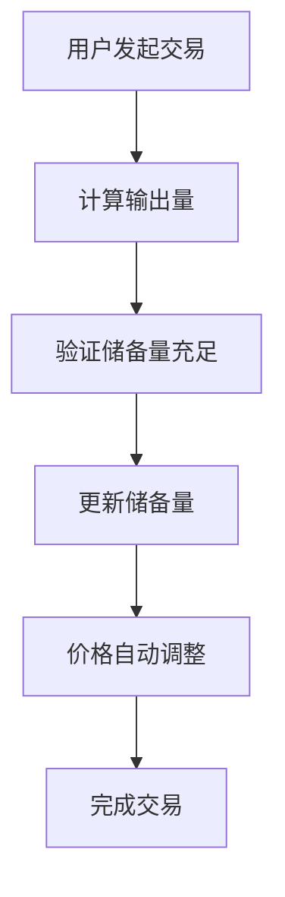

# 流动性池原理探究：去中心化交易的核心机制

## 目录
1. [流动性池基本概念](#1-流动性池基本概念)
2. [工作原理深度分析](#2-工作原理深度分析)
3. [与传统订单簿交易的区别](#3-与传统订单簿交易的区别)
4. [流动性提供者收益机制](#4-流动性提供者收益机制)
5. [风险分析：无常损失等](#5-风险分析无常损失等)
6. [数学原理深度解析](#6-数学原理深度解析)
7. [不同AMM模型对比](#7-不同amm模型对比)
8. [实际应用案例分析](#8-实际应用案例分析)
9. [未来发展趋势](#9-未来发展趋势)
10. [总结与展望](#10-总结与展望)

---

## 1. 流动性池基本概念

### 1.1 什么是流动性池

流动性池（Liquidity Pool）是去中心化交易所（DEX）的核心机制，它是一个智能合约，存储着两种或多种代币的储备量。用户可以直接与这个池子进行交易，而不需要传统的订单簿匹配系统。

**核心特征**：
- **自动化**：基于数学公式自动确定价格
- **去中心化**：无需中介机构
- **24*7交易**：随时可以进行交易
- **流动性集中**：所有流动性集中在一个池中

### 1.2 核心组成要素

| 要素 | 描述 | 作用 |
|------|------|------|
| **储备量（Reserves）** | 池中存储的代币数量 | 决定交易深度和价格 |
| **流动性代币（LP Tokens）** | 代表流动性提供者在池中份额的凭证 | 证明提供者的权益 |
| **自动做市商（AMM）** | 基于数学公式自动确定价格的算法 | 实现自动化交易 |
| **滑点（Slippage）** | 大额交易对价格的影响 | 影响交易成本 |

### 1.3 历史发展

**发展阶段**：
1. **早期阶段**：Bancor协议首次引入AMM概念
2. **成熟阶段**：Uniswap V2成为行业标准
3. **优化阶段**：Uniswap V3引入集中流动性
4. **创新阶段**：各种专业化AMM模型涌现

---

## 2. 工作原理深度分析

### 2.1 恒定乘积公式（x * y = k）

最经典的流动性池使用恒定乘积公式：

```
x * y = k
```

**参数说明**：
- `x` = 代币A的储备量
- `y` = 代币B的储备量  
- `k` = 常数（流动性不变时保持不变）

**价格计算**：
- 代币A的价格 = y / x
- 代币B的价格 = x / y

### 2.2 交易执行流程



**详细步骤**：
1. **用户发起交易**：用户想要用代币A换取代币B
2. **计算输出量**：根据恒定乘积公式计算能获得多少代币B
3. **验证储备量**：确保池中有足够的代币B
4. **更新储备量**：池中代币A增加，代币B减少
5. **价格调整**：由于储备量变化，价格自动调整

### 2.3 实际交易示例

**场景设置**：ETH/USDC池
- 初始状态：1000 ETH, 2,000,000 USDC
- 用户用100 ETH换取USDC

**计算过程**：
```
计算公式
 x * y = k
 (x + dx)*(y - dy) = k = L ^ 2 
 x*y - x * dy + dx * y -dx * dy =  x*y
 - x*dy + dx*y - dx * dy = 0
 dy(-x-dx) + dx * y = 0
 dy(-x-dx) = - dx * y
 dy = (-dx * y) / (-x-dx)
 dy = -1 *(dx *y) / -1 * (x + dx)
 dy = dx * y / x + dx
 
 dx = 100
 y = 2,000,000
 x = 1000

k = 1000 * 2,000,000 = 2,000,000,000
新ETH储备 = 1000 + 100 = 1100
新USDC储备 = 2,000,000,000 / 1100 ≈ 1,818,182
用户获得 = 2,000,000 - 1,818,182 = 181,818 USDC
```

**结果分析**：
- 用户获得181,818 USDC
- 实际汇率：1 ETH = 1,818.18 USDC
- 价格影响：约9.1%

### 2.4 手续费机制

**手续费计算**：
```
实际输入量 = 输入量 × (1 - 手续费率)
手续费率通常为0.3%
```

**手续费分配**：
- 直接加入池中，增加LP代币价值
- 按LP代币持有比例分配给流动性提供者

---

## 3. 与传统订单簿交易的区别

### 3.1 传统订单簿模式

**工作原理**：
- 买卖双方挂单等待匹配
- 价格由市场供需决定
- 需要足够的买卖双方才能成交
- 流动性分散，深度有限

**优势**：
- 价格发现机制完善
- 滑点控制较好
- 适合大额交易

**劣势**：
- 流动性不足时交易困难
- 小币种难以找到交易对手
- 价格波动剧烈
- 需要做市商提供流动性

### 3.2 流动性池模式

**工作原理**：
- 基于数学公式自动定价
- 24/7即时交易
- 无需等待交易对手
- 流动性集中管理

**优势**：
- 24/7即时交易
- 无需等待交易对手
- 价格自动调整
- 任何人都可以提供流动性
- 去中心化程度更高

**劣势**：
- 大额交易会产生滑点
- 价格由数学公式决定，可能偏离市场价
- 流动性提供者承担风险

### 3.3 详细对比分析

| 特性 | 订单簿模式 | 流动性池模式 |
|------|------------|--------------|
| **流动性来源** | 做市商、交易者 | 流动性提供者 |
| **价格发现** | 市场供需 | 数学公式 |
| **交易执行** | 需要匹配 | 即时执行 |
| **流动性深度** | 分散 | 集中 |
| **滑点控制** | 较好 | 大额交易滑点大 |
| **去中心化程度** | 中等 | 高 |
| **资本效率** | 中等 | 高 |
| **技术复杂度** | 中等 | 低 |
| **适用场景** | 大额交易 | 小额到中等交易 |

### 3.4 混合模式

**发展趋势**：
- 结合两种模式的优势
- 动态调整交易策略
- 根据市场条件选择最优模式

---

## 4. 流动性提供者收益机制

### 4.1 收益来源分析

**主要收益来源**：

1. **交易手续费收益**（主要来源）
   - 每笔交易收取0.3%手续费（以Uniswap V2为例）
   - 手续费按LP代币持有比例分配
   - 手续费直接加入池中，增加LP代币价值

2. **代币价格升值**
   - 如果提供流动性的代币价格上涨
   - 直接增加LP代币价值

3. **挖矿奖励**
   - 部分协议提供额外代币奖励
   - 通过治理代币激励流动性提供

### 4.2 收益计算详解

**LP代币价值计算**：
```
LP代币价值 = (代币A数量 × 代币A价格) + (代币B数量 × 代币B价格)
```

**手续费收益计算**：
```
手续费收益 = 交易量 × 手续费率 × LP持有比例
```

**年化收益率计算**：
```
年化收益率 = (总收益 / 初始投资) × (365 / 投资天数) × 100%
```

### 4.3 收益最大化策略

**策略选择**：

1. **选择高交易量交易对**
   - 交易量越大，手续费收益越高
   - 关注24小时交易量数据
   - 选择主流代币对

2. **选择稳定币对**
   - 减少价格波动风险
   - 降低无常损失
   - 适合保守投资者

3. **关注手续费率**
   - 不同协议手续费率不同
   - 选择手续费率较高的协议
   - 考虑协议安全性

4. **考虑挖矿奖励**
   - 评估额外代币奖励价值
   - 计算总收益
   - 关注奖励代币的流动性

### 4.4 收益风险平衡

**风险收益矩阵**：

| 策略类型 | 预期收益 | 风险等级 | 适用人群 |
|----------|----------|----------|----------|
| 稳定币对 | 低-中等 | 低 | 保守投资者 |
| 主流代币对 | 中等 | 中等 | 平衡投资者 |
| 新兴代币对 | 高 | 高 | 激进投资者 |

---

## 5. 风险分析：无常损失等

### 5.1 无常损失（Impermanent Loss）

**定义**：
无常损失是指流动性提供者相比简单持有代币所遭受的损失。

**产生原因**：
当池中代币价格比例发生变化时，AMM会自动调整储备比例，导致LP代币价值低于等量代币的持有价值。

**计算公式**：
```
无常损失 = 2 × √(价格比率) / (1 + 价格比率) - 1
```

**实际示例**：
- 初始：1 ETH = 2000 USDC
- 提供流动性：1 ETH + 2000 USDC
- 价格变化：1 ETH = 4000 USDC
- 无常损失 ≈ 5.7%

**无常损失表**：

| 价格变化 | 无常损失 |
|----------|----------|
| 1.25倍 | 0.6% |
| 1.5倍 | 2.0% |
| 2倍 | 5.7% |
| 3倍 | 13.4% |
| 4倍 | 20.0% |
| 5倍 | 25.5% |

### 5.2 其他主要风险

#### 5.2.1 智能合约风险
- **代码漏洞**：智能合约可能存在未发现的漏洞
- **黑客攻击**：恶意攻击者利用漏洞盗取资金
- **协议升级风险**：协议升级可能引入新风险

**缓解措施**：
- 选择经过审计的协议
- 关注安全事件报告
- 分散投资多个协议

#### 5.2.2 市场风险
- **代币价格暴跌**：提供流动性的代币价格大幅下跌
- **流动性枯竭**：池中流动性不足，难以退出
- **极端市场条件**：黑天鹅事件导致市场崩溃

**缓解措施**：
- 选择稳定币对
- 设置止损点
- 关注市场动态

#### 5.2.3 技术风险
- **网络拥堵**：区块链网络拥堵导致交易失败
- **Gas费用过高**：交易成本超过收益
- **交易失败**：交易被回滚或失败

**缓解措施**：
- 选择合适的Gas价格
- 避免网络拥堵时段交易
- 使用Layer 2解决方案

#### 5.2.4 监管风险
- **政策变化**：监管政策变化影响DeFi发展
- **合规要求**：新的合规要求增加成本
- **法律不确定性**：法律地位不明确

**缓解措施**：
- 关注监管动态
- 选择合规的协议
- 分散投资降低风险

### 5.3 风险缓解策略

**综合风险管理**：

1. **分散投资**
   - 不要将所有资金投入单一池
   - 选择不同类型的交易对
   - 分散到不同协议

2. **选择稳定币对**
   - 减少价格波动风险
   - 降低无常损失
   - 适合长期持有

3. **关注协议安全**
   - 选择经过审计的协议
   - 关注安全事件
   - 评估团队背景

4. **设置止损**
   - 及时退出亏损的流动性
   - 设置最大损失限额
   - 定期评估投资表现

5. **监控市场**
   - 关注代币价格变化
   - 监控市场情绪
   - 及时调整策略

---

## 6. 数学原理深度解析

### 6.1 价格影响函数

在恒定乘积模型中，交易对价格的影响是非线性的：

```
价格影响 = (交易量 / 储备量) / (1 + 交易量 / 储备量)
```

**特点**：
- 交易量越大，价格影响越大
- 储备量越大，价格影响越小
- 价格影响呈非线性增长

### 6.2 滑点计算

滑点是指预期价格与实际成交价格的差异：

```
滑点 = (预期价格 - 实际价格) / 预期价格 × 100%
```

**滑点影响因素**：
- 交易量大小
- 池中流动性深度
- 市场波动性
- 网络拥堵程度

### 6.3 流动性深度

流动性深度决定了价格稳定性：

```
流动性深度 = 储备量 / 价格变化率
```

**深度指标**：
- **浅池**：流动性不足，价格波动大
- **深池**：流动性充足，价格稳定
- **最优深度**：平衡收益和风险

### 6.4 数学公式推导

**恒定乘积公式推导**：

假设初始状态：
- 代币A储备：x
- 代币B储备：y
- 常数：k = x × y

用户用Δx代币A换取Δy代币B：
- 新储备：x + Δx, y - Δy
- 新常数：k' = (x + Δx) × (y - Δy)

保持k不变：
```
k = k'
x × y = (x + Δx) × (y - Δy)
```

求解Δy：
```
Δy = (Δx × y) / (x + Δx)
```

**考虑手续费**：
```
实际输入 = Δx × (1 - fee)
fee = 0.3% = 0.003
```

最终公式：
```
Δy = (Δx × 997 × y) / (x × 1000 + Δx × 997)
```

---

## 7. 不同AMM模型对比

### 7.1 恒定乘积模型（x × y = k）

**代表协议**：Uniswap V2, SushiSwap

**特点**：
- 价格曲线为双曲线
- 价格范围：0 到 ∞
- 流动性分布均匀

**优势**：
- 简单易懂
- 去中心化程度高
- 适合长尾代币

**劣势**：
- 大额交易滑点大
- 资本效率低
- 价格发现能力有限

### 7.2 恒定和模型（x + y = k）

**特点**：
- 价格固定
- 价格范围：有限
- 流动性容易耗尽

**优势**：
- 无滑点
- 价格稳定

**劣势**：
- 容易耗尽流动性
- 适用范围有限
- 不适合价格波动大的代币

### 7.3 恒定平均值模型

**代表协议**：Balancer

**特点**：
- 支持多代币池
- 可自定义权重
- 灵活性高

**优势**：
- 支持多代币
- 可自定义参数
- 适合投资组合管理

**劣势**：
- 复杂度高
- 理解门槛高
- 计算成本高

### 7.4 混合模型

**代表协议**：Curve, Uniswap V3

**Curve特点**：
- 针对稳定币优化
- 低滑点
- 高资本效率

**Uniswap V3特点**：
- 集中流动性
- 多层级手续费
- 高资本效率

**优势**：
- 针对特定场景优化
- 资本效率高
- 滑点控制好

**劣势**：
- 适用范围有限
- 复杂度高
- 理解门槛高

### 7.5 模型选择指南

| 使用场景 | 推荐模型 | 理由 |
|----------|----------|------|
| 稳定币交易 | Curve | 低滑点，高效率 |
| 长尾代币 | Uniswap V2 | 简单，去中心化 |
| 专业交易 | Uniswap V3 | 高资本效率 |
| 投资组合 | Balancer | 多代币支持 |
| 新兴代币 | Uniswap V2 | 流动性充足 |

---

## 8. 实际应用案例分析

### 8.1 Uniswap V2

**基本信息**：
- **模型**：恒定乘积
- **手续费**：0.3%
- **特点**：简单、去中心化
- **适用场景**：长尾代币交易

**优势分析**：
- 代码开源，透明度高
- 社区治理，去中心化
- 生态丰富，集成度高
- 流动性充足

**劣势分析**：
- 大额交易滑点大
- 资本效率低
- 手续费固定

**适用人群**：
- 普通用户
- 小到中等交易
- 长尾代币交易

### 8.2 Uniswap V3

**基本信息**：
- **模型**：集中流动性
- **手续费**：0.05%, 0.3%, 1%
- **特点**：资本效率高
- **适用场景**：专业交易者

**创新特点**：
- 集中流动性：LP可以选择价格区间
- 多层级手续费：不同价格区间不同手续费
- 高资本效率：相同流动性提供更多交易深度

**优势分析**：
- 资本效率高
- 滑点控制好
- 手续费灵活
- 适合专业交易

**劣势分析**：
- 复杂度高
- 理解门槛高
- 需要主动管理

**适用人群**：
- 专业交易者
- 大额交易
- 对资本效率要求高的用户

### 8.3 Curve

**基本信息**：
- **模型**：稳定币优化
- **手续费**：0.04%
- **特点**：低滑点
- **适用场景**：稳定币交易

**技术特点**：
- 针对稳定币优化
- 低滑点设计
- 高资本效率
- 多种稳定币支持

**优势分析**：
- 稳定币交易滑点极低
- 资本效率高
- 手续费低
- 适合大额交易

**劣势分析**：
- 适用范围有限
- 只适合稳定币
- 技术门槛高

**适用人群**：
- 稳定币交易者
- 大额稳定币交易
- 对滑点敏感的用户

### 8.4 Balancer

**基本信息**：
- **模型**：多代币池
- **手续费**：可配置
- **特点**：灵活性高
- **适用场景**：投资组合管理

**技术特点**：
- 支持多代币池
- 可自定义权重
- 灵活的手续费设置
- 投资组合管理

**优势分析**：
- 支持多代币
- 灵活性高
- 可自定义参数
- 适合投资组合

**劣势分析**：
- 复杂度高
- 理解门槛高
- 计算成本高

**适用人群**：
- 投资组合管理者
- 多代币持有者
- 专业投资者

### 8.5 协议选择指南

**选择标准**：

1. **交易类型**
   - 稳定币交易：选择Curve
   - 长尾代币：选择Uniswap V2
   - 专业交易：选择Uniswap V3

2. **交易规模**
   - 小额交易：Uniswap V2
   - 大额交易：Uniswap V3或Curve

3. **风险承受能力**
   - 保守：稳定币对
   - 平衡：主流代币对
   - 激进：新兴代币对

4. **技术能力**
   - 初学者：Uniswap V2
   - 进阶用户：Uniswap V3
   - 专业用户：Balancer

---

## 9. 未来发展趋势

### 9.1 技术创新

#### 9.1.1 集中流动性优化
- **动态调整**：根据市场条件自动调整流动性分布
- **智能路由**：自动选择最优价格区间
- **机器学习**：预测最优流动性配置

#### 9.1.2 多层级手续费
- **动态手续费**：根据市场波动调整手续费
- **差异化收费**：不同用户类型不同费率
- **激励机制**：奖励长期流动性提供者

#### 9.1.3 跨链流动性
- **跨链聚合**：聚合多链流动性
- **原子交换**：跨链原子交易
- **流动性桥接**：连接不同链的流动性

#### 9.1.4 高级AMM模型
- **混合模型**：结合多种AMM优势
- **自适应模型**：根据市场条件调整参数
- **专业化模型**：针对特定资产优化

### 9.2 协议优化

#### 9.2.1 Gas优化
- **批量交易**：减少Gas消耗
- **状态压缩**：优化存储结构
- **Layer 2集成**：降低交易成本

#### 9.2.2 MEV保护
- **隐私交易**：保护交易隐私
- **抗抢跑**：防止MEV攻击
- **公平排序**：确保交易公平性

#### 9.2.3 价格预言机
- **多源聚合**：提高价格准确性
- **实时更新**：降低价格延迟
- **抗操纵**：防止价格操纵

#### 9.2.4 风险管理
- **保险机制**：为流动性提供者提供保险
- **风险监控**：实时监控风险指标
- **自动止损**：自动退出高风险位置

### 9.3 生态扩展

#### 9.3.1 衍生品交易
- **期权交易**：基于AMM的期权交易
- **期货交易**：去中心化期货市场
- **合成资产**：合成各种金融资产

#### 9.3.2 借贷协议
- **流动性代币抵押**：LP代币作为抵押品
- **杠杆交易**：基于流动性的杠杆交易
- **收益优化**：自动优化收益策略

#### 9.3.3 收益聚合
- **自动复投**：自动复投收益
- **策略优化**：自动选择最优策略
- **风险平衡**：自动平衡风险和收益

#### 9.3.4 治理机制
- **社区治理**：社区参与协议治理
- **代币激励**：治理代币激励参与
- **去中心化决策**：去中心化决策机制

### 9.4 技术挑战

#### 9.4.1 可扩展性
- **交易吞吐量**：提高交易处理能力
- **延迟优化**：降低交易延迟
- **成本控制**：降低交易成本

#### 9.4.2 安全性
- **代码审计**：持续的安全审计
- **漏洞修复**：快速响应安全漏洞
- **风险控制**：完善的风险控制机制

#### 9.4.3 用户体验
- **界面优化**：简化用户界面
- **操作简化**：降低操作复杂度
- **教育普及**：提高用户理解

#### 9.4.4 监管合规
- **合规框架**：建立合规框架
- **监管沟通**：与监管机构沟通
- **法律风险**：降低法律风险

---

## 10. 总结与展望

### 10.1 流动性池的核心价值

#### 10.1.1 降低交易门槛
- **无需许可**：任何人都可以参与
- **24/7交易**：随时可以进行交易
- **全球访问**：无地域限制
- **低门槛**：小额资金也可以参与

#### 10.1.2 提高资本效率
- **资金利用率高**：资金得到充分利用
- **自动化管理**：减少人工干预
- **即时交易**：无需等待匹配
- **流动性集中**：提高流动性效率

#### 10.1.3 增强市场流动性
- **持续交易**：24/7不间断交易
- **深度流动性**：集中流动性提供深度
- **价格稳定**：减少价格波动
- **市场活跃**：促进市场活跃度

#### 10.1.4 促进去中心化
- **减少中介**：减少对中介的依赖
- **社区治理**：社区参与治理
- **开源透明**：代码开源透明
- **抗审查**：抗审查特性

### 10.2 面临的挑战

#### 10.2.1 技术复杂性
- **理解门槛**：需要理解AMM机制
- **操作复杂**：操作相对复杂
- **风险认知**：需要理解各种风险
- **技术更新**：技术快速更新

#### 10.2.2 风险管理
- **无常损失**：主要风险之一
- **智能合约风险**：代码风险
- **市场风险**：市场波动风险
- **流动性风险**：流动性不足风险

#### 10.2.3 监管不确定性
- **政策变化**：监管政策可能变化
- **合规要求**：新的合规要求
- **法律风险**：法律地位不明确
- **国际协调**：国际监管协调困难

#### 10.2.4 竞争激烈
- **协议竞争**：协议间竞争激烈
- **技术竞争**：技术竞争激烈
- **用户竞争**：用户争夺激烈
- **生态竞争**：生态建设竞争

### 10.3 未来发展方向

#### 10.3.1 技术创新
- **更高效的AMM模型**：提高资本效率
- **跨链技术**：实现跨链流动性
- **AI集成**：人工智能优化交易
- **量子计算**：量子计算应用

#### 10.3.2 生态扩展
- **更多应用场景**：扩展到更多领域
- **传统金融集成**：与传统金融结合
- **实体经济**：服务实体经济
- **社会治理**：参与社会治理

#### 10.3.3 用户体验
- **简化操作流程**：降低操作复杂度
- **智能推荐**：智能推荐最优策略
- **风险提示**：实时风险提示
- **教育普及**：普及相关知识

#### 10.3.4 风险管理
- **更好的风险控制**：完善风险控制机制
- **保险机制**：引入保险机制
- **风险分散**：风险分散工具
- **预警系统**：风险预警系统

### 10.4 对参与者的建议

#### 10.4.1 对投资者
1. **充分学习**：深入学习相关知识
2. **风险意识**：充分认识各种风险
3. **分散投资**：不要集中投资
4. **长期视角**：保持长期投资视角
5. **持续关注**：关注市场动态

#### 10.4.2 对开发者
1. **技术掌握**：深入掌握相关技术
2. **安全第一**：始终把安全放在第一位
3. **用户体验**：注重用户体验
4. **创新应用**：探索新的应用场景
5. **社区建设**：积极参与社区建设

#### 10.4.3 对监管者
1. **理解技术**：深入理解技术原理
2. **平衡监管**：平衡创新和风险
3. **国际合作**：加强国际合作
4. **持续学习**：持续学习新技术
5. **政策引导**：通过政策引导发展

### 10.5 最终展望

流动性池作为去中心化金融的核心基础设施，将继续推动DeFi生态的发展。随着技术的不断进步和生态的完善，流动性池将在未来的金融体系中发挥更加重要的作用。

**关键趋势**：
- 技术不断创新，效率持续提升
- 应用场景不断扩展，生态日益丰富
- 用户体验持续改善，门槛不断降低
- 风险管理不断完善，安全性持续提升

**最终目标**：
- 实现真正的去中心化金融
- 提供更好的金融服务
- 促进金融包容性
- 推动金融创新

流动性池的发展不仅是一个技术问题，更是一个社会问题。它关系到金融体系的未来，关系到每个人的金融权利。理解其工作原理、风险机制和收益模式，对于参与DeFi生态的投资者和开发者都至关重要。

随着技术的不断进步和生态的完善，流动性池将在未来的金融体系中发挥更加重要的作用，推动DeFi生态的持续发展，最终实现更加开放、透明、高效的金融体系。

